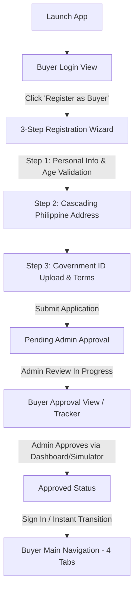
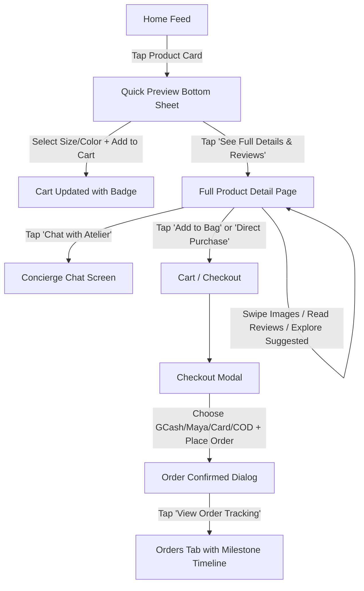
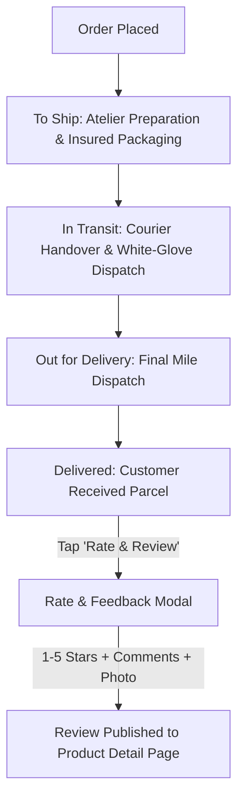

# Workflows

## Purpose
Defines **HOW** the mobile application behaves: step-by-step user flows, navigation triggers, and state transitions.

---

## 1. Customer Onboarding & Approval Lifecycle

### States
- `unauthenticated`: Renders `BuyerLoginView`.
- `pendingApproval`: Renders `BuyerApprovalView` (milestones 1-4 with interactive Admin Simulator).
- `approved`: Renders `BuyerMainNavigation` (Home, Cart, Orders, Profile).

---

## 2. Product Discovery & Purchase Flow

---

## 3. Post-Purchase Fulfillment & Feedback Lifecycle

